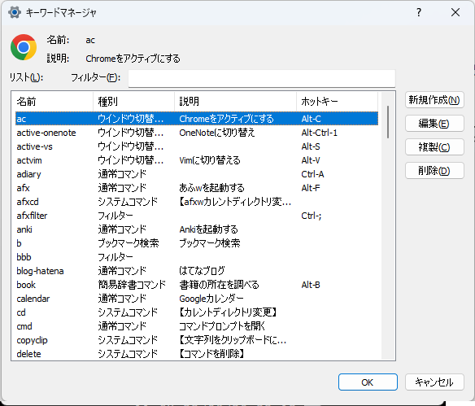

# Soyokaze

bluewind代替とすべく作成しているランチャーソフト。


## bluewindとは

bluewindのReadMeから抜粋
```
初心者から上級者まで幅広く使えるコマンドラインランチャーです。
簡単なキーワードをファイルやURLに関連付け、
キーボードからそのキーワードを打ち込むことで
アプリケーションを起動させたり、Webサイトを開いたりできます。
```

個人的にとても気に入って長年使ってきたツールで、
今でも普通に使えるけど、一次配布元サイトが消滅(&更新停止)して久しい。

## 動作環境

下記環境での動作を確認済

- Windows 11(64bit)
- Windows 10(64bit)

## インストール手順

1. zipをファイルを展開して任意のフォルダに展開する
1. 展開先フォルダにある`soyokaze.exe`を実行する
1. 設定はユーザフォルダ(たいていは C:/Users/(ユーザ名))直下の`.soyokaze`フォルダに保存される  
初回実行時に`.soyokaze`フォルダを作成する
  * レジストリを一切変更しない

## アンインストール手順

アンインストーラはないため、以下すべてを手動で行う。

1. アプリケーションの設定-ショートカット設定を表示し、すべてのショートカットを削除する
1. `soyokaze.exe`を終了する
1. インストール時に`soyokaze.exe`を置いたフォルダごと削除する
1. 設定フォルダ(C:/Users/(ユーザ名)/.soyokaze)を削除する

## ファイル構成

- soyokaze.exe
- help.html
- LICENSE

## 主な特徴

- ホットキーでウインドウの呼び出しができる。初期値はAlt-Space
- 任意のファイルやフォルダを登録してキーワードで呼び出すことができる
- 登録したキーワード(コマンド)に対してショートカットキーを設定することができる
- レジストリを変更しない
- ファイル名やURLを直接指定しての実行が可能
- パラメータにキーワードを使用することができる

## マニュアル

[マニュアル](doc/help.md) を参照

- `Pandoc`からHTMLを生成するためのMarkdownファイルのため、そのための記述がファイル冒頭と末尾にある

## 実行時に必要なライブラリ

以下のライブラリがあると、追加の機能を利用することができるが、なくても動作する。

- [Python3](https://www.python.org/) 
  - 電卓機能を利用するために必要

- [C/Migemo](https://www.kaoriya.net/software/cmigemo/) 
  - ローマ字による日本語文字列検索を利用するために必要
    - 例えば、`jikoku`で`時刻`や`自国`にヒットするようになる

## 画面など

画面のつくりはbluewindにある程度似せて作っている

### 入力画面


### キーワードマネージャ



### コマンド登録・編集画面


### 設定画面


## ビルド方法

[HowToBuild.md](./HowToBuild.md) を参照


### キーワード絞込みの仕様

- 指定したキーワードが候補の名前に部分一致するかどうかで判断を行う
- スペース区切りで複数キーワード指定された場合、個々のキーワードごとに候補の名前と部分一致比較を行い、すべてマッチするものを対象とする

- 一致の度合いに応じて、候補の表示順序を変えている。一致度の区分として以下の3種類がある。  
先に挙げたほうが優先順位が高い(先に表示する)
  - 完全一致
    - キーワードのいずれかが、候補と完全一致する場合、完全一致とみなす
  - 前方一致
    - 先頭のキーワードと候補が前方一致する場合、前方一致とみなす
  - 部分一致
    - 与えられたキーワードが候補に部分的に一致する場合、部分一致とみなす

- ダブルクォーテーションで囲った場合はキーワードに空白を含めることができる
- 複数のキーワードが与えられた場合に先頭キーワードと候補が完全一致する場合、後続のキーワードをパラメータ指定とみなす

## ToDo

- 設計資料を残す
- ユニットテスト拡充

## ChangeLog

[CHANGELOG.md](./CHANGELOG.md)

## ライセンス

[MIT License](./LICENSE)

