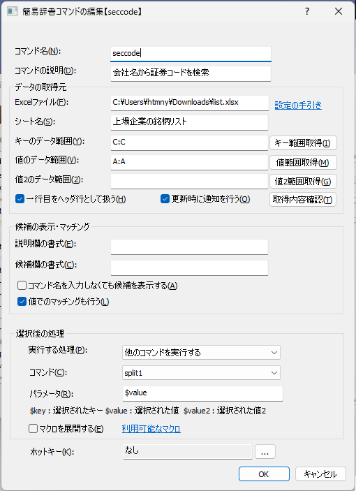
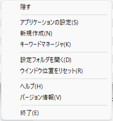
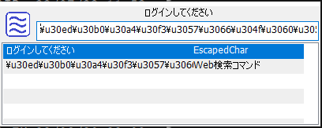

<style>

#TOC {
  position : sticky;
  overflow-y : scroll;
  float: left;
  top:15px;
  width: 31.0%;
  height:95vh;
  text-align: left;
}
.column-right{
  float: right;
  width: 62.0%;
  text-align: left;
}
</style>

<div class="column-right">

# Soyokaze マニュアル

## 概要

Soyokazeは`bluewind`というコマンドラインランチャーに似せて作ったツール  
bluewindの使用感を維持しつつ、現行のWindows環境でも動作するコマンドラインランチャーを実現することを目的としている。


## 動作環境

Windows環境で動作する。以下の環境で動作確認済

- Windows11 64bit
- Windows10 64bit

### 実行時に必要なもの

- [Python3](https://www.python.org/) (任意)
  - [電卓機能](#電卓機能)を利用するために必要(利用しない場合は不要)

- [C/Migemo](https://www.kaoriya.net/software/cmigemo/) (任意)
  - ローマ字のまま日本語キーワードの絞り込み(Migemo検索)を利用するために必要
  - Migemo検索を利用しない場合は不要

## セットアップ

### インストール

1. zipをファイルを展開して任意のフォルダに展開する
1. 展開先フォルダにある`soyokaze.exe`を実行する
1. 設定はユーザフォルダ(たいていは C:/Users/(ユーザ名))直下の`.soyokaze`フォルダに保存される  
初回実行時に`.soyokaze`フォルダを作成する
  * レジストリを使用しない

### アンインストール

アンインストーラはないため、以下すべてを手動で行う。

1. タスクトレイ上のコンテキストメニュー-`アプリケーションの設定`-`基本`-`ショートカット設定`を表示し、`作成したショートカットをすべてを削除する`を押下する
1. `soyokaze.exe`を終了する
1. インストール時に`soyokaze.exe`を置いたフォルダを削除する
1. 設定フォルダ(C:/Users/(ユーザ名)/.soyokaze)を削除する

### バージョンアップ

1. 本アプリを実行している場合は終了する
1. `soyokaze.exe`を置いたフォルダ内のファイルをすべて上書きする

アプリケーションの設定は`C:\Users\(ユーザ名)\.soyokaze`に保存される

- ポータブル版の場合はフォルダ内のファイル一式を上書きする

#### 注意

- 0.14.0で作成したウインドウ整列コマンドの設定情報を0.15.0以降のバージョンに移行することはできない
  - 整列対象ウインドウの再登録が必要

## 基本的な使い方

- `soyokaze.exe`を実行すると[入力画面](#入力画面) が表示される  

- ホットキー(デフォルト設定は`Alt-Space`)を押下すると、入力画面の表示／非表示が切り替わる
- 初回起動時は何もコマンドが登録されていない状態なので、[次セクションに記載する方法](#コマンドの登録方法)によりコマンドを登録する
- コマンドの登録がすんだら、あとはホットキーから入力画面を呼び出して、キーワードを入力してコマンドを実行する

## コマンドの登録方法

本アプリでは以下の方法でコマンドを登録することができる

- [`new`コマンドで登録する](#newコマンドで登録する)
- [`registwin`コマンドで登録する](#registwinコマンドで登録する)
- [対象ウインドウをDrag&Dropする](#対象ウインドウをdragdropする)
- [コンテキストメニューの`送る`>`コマンドとして登録する`](#コンテキストメニューの送るコマンドとして登録する`)

各方法の詳細について後述する。

### newコマンドで登録する

入力画面から`new`コマンドを実行すると、[コマンドの種類を選択](#コマンドの種類)する画面が表示される。  
↓  


コマンド種別を選択し、`OK`ボタンを押下すると、選択した種別に応じたコマンド編集画面が表示される。  
↓※ 通常コマンドのコマンド編集画面  
  

コマンド編集画面で新規登録キーワードや紐づけるプログラムへのパスなどの情報を入力し、OKを押すと、コマンドとして登録される。

### registwinコマンドで登録する

入力画面から`new`コマンドを実行すると、直前にアクティブになっていたウインドウの実行プロセスを登録する画面が表示される。  
↓  
  

###  対象ウインドウをDrag&Dropする

入力画面のアイコン欄をドラッグして、登録したいウインドウにドロップすると、そのウインドウの実行プロセスを登録する画面が表示される。  
↓  
  

### コンテキストメニューの`送る`>`コマンドとして登録する`

登録したいファイルをエクスプローラ上で右クリックして、`送る`>`コマンドとして登録する`を選択すると、そのファイルを登録するためのコマンド編集画面が表示される  
↓  
  

## コマンドの種類

`new`コマンドを実行したときに選択できるコマンド種類について説明する

以下の10つのコマンドが選択できる

- 通常コマンド
- スニペットコマンド(定型文コマンド)
- Web検索コマンド
- グループコマンド
- 正規表現コマンド
- フィルタコマンド
- ウインドウ切替コマンド
- ウインドウ整列コマンド
- (試作)簡易辞書コマンド
- (試作)フォルダ更新検知コマンド

### 通常コマンド

ファイルやURLなどを関連付けられたプログラムで表示するためのコマンド

  

- `コマンドの名前`にコマンド名(キーワード)を、`実行ファイル・URLなど`に、紐づけるファイルやURLを指定する。
- プログラムを実行する場合、`パラメータ`に実行時オプションを指定することができる。
  - 実行時オプションに`$*` `$1` `$2`...を指定すると、入力欄でキーワードの後に入力した文字列をパラメータとして渡すことができる

#### 実行時の動作

|押下キー|動作|
|--|--|
|`Enter`|ファイルを実行する or ディレクトリを開く|
|`Ctrl-Enter`|パス(ファイルが存在するディレクトリ)を開く|
|`Shift-Ctrl-Enter`|管理者権限で実行する|

### スニペットコマンド(定型文コマンド)

あらかじめ登録しておいた定型文をクリップボードにコピーするためのコマンド

  

- `コマンドの名前`にコマンド名(キーワード)を、`テキスト`に、定型文の内容を指定する。

#### 実行時の動作

|押下キー|動作|
|--|--|
|`Enter`|設定されたテキストをクリップボードにコピーする|

### Web検索コマンド

Google検索やWikipediaなどのWeb検索を行うためのコマンド


- `コマンドの名前`にコマンド名(キーワード)を、`検索URL`に検索するサイトのURLを指定する。
  - 検索URLに`$*`を指定すると、検索ワードに置換される
    - 例えばGoogle検索を行う場合は、`https://www.google.com/search?q=$*`と指定すればよい

- `常に検索候補として表示する`をチェックすると、コマンド名を入力しなくても、検索ワードを入れるだけで候補として表示されるようになる


#### 実行時の動作

|押下キー|動作|
|--|--|
|`Enter`|ブラウザで検索を実行する|

[](../image/shortcut-search.png)

### グループコマンド

本アプリに登録済のコマンドを複数まとめて実行するためのコマンド

  

- 上の図の場合、`xxx`→`vim`→`twitter`という順にコマンドを順次実行する、という意味
- 完了するまで待つにチェックすると、そのコマンドが完了するのを待つ

#### 実行時の動作

|押下キー|動作|
|--|--|
|`Enter`|登録された内容を実行する|

### 正規表現コマンド

指定した正規表現パターンに合致する場合に、その内容に応じてコマンドを実行するためのコマンド

  

他のコマンド種類と異なり、登録した名前でマッチングを行うのではなく、`パターン`で指定した正規表現でマッチングを行う。  
正規表現にマッチしたときにキャプチャしたものを`$1``$2`...で参照し、起動するコマンドに渡すことができる。

#### 実行時の動作

|押下キー|動作|
|--|--|
|`Enter`|ファイルを実行する or ディレクトリを開く|


##### 想定する用途

- 課題追跡システムや障害管理システムのIssueの識別子(例:`ProjectXXX-1234`)のようなパターンを拾って、それをもとに直接Issue画面を表示する

### フィルタコマンド

前段で実行したプログラムが標準出力に出力した内容をもとに、  
それを絞り込むための専用の入力画面を表示し、  
選択した結果をもとに後段のプログラムを実行するためのコマンド。


わかる人向けに書くと、`fzf`や`peco`風なことをやるためのもの。


とはいえ、大量のデータを高速に絞り込むことを意識した実装などは全くしてないので、大量データを扱うならしかるべきツールを使うのが吉  
(このコマンドはインクリメンタルな絞り込みをする手段をお手軽に提供するためのものなので..)

#### 実行時の動作

|押下キー|動作|
|--|--|
|`Enter`|ファイルを実行する or ディレクトリを開く|


### ウインドウ切替コマンド

ウインドウタイトルやウインドウクラス名を指定して、合致するウインドウがあれば、それをアクティブにする(前面に出す)ためのコマンド。

検索条件をあらかじめ設定しておき、それに対してキーワードやホットキーを設定することができるので、
よく使うアプリケーションのウインドウをコマンドとして登録しておけば、素早くそのアプリに切り替えることができる。


上記の設定でコマンドを作っておくと、下記の操作のいずれかでGVimのウインドウに切り替えることができる。

- キーワード`va`を実行する
- `Alt-V`押下

まぎらわしいが、[ウインドウ切り替え](#ウインドウ切り替え)とは別物。

#### 実行時の動作

|押下キー|動作|
|--|--|
|`Enter`|ウインドウを切り替える|


### ウインドウ整列コマンド

ウインドウの位置とサイズを指定しておいて、一括設定するためのコマンド。

普段よく使うアプリの「いつもの配置」を登録しておけば、それをすぐに再現することができる。


- 例:電卓とペイントをあらかじめ決めた位置に並べる


#### 実行時の動作

|押下キー|動作|
|--|--|
|`Enter`|ウインドウの整列を実行する|

### (試作)簡易辞書コマンド

Excelワークブックファイル(`*.xlsx,*.xls`)の任意の範囲のデータを簡易的な辞書データとして利用し、
入力欄から辞書データをインクリメンタル検索する機能。  
Excelを利用するため、実行環境にExcelがインストールされている必要がある。

- イメージ  


- 設定画面  



#### 実行時の動作

|押下キー|動作|
|--|--|
|`Enter`|辞書データの内容をクリップボードにコピーする|

### (試作)フォルダ更新検知コマンド

任意のフォルダを監視し、フォルダ内のファイルの変更を検知したときに通知してくれるコマンド。

- 設定画面  


- 更新通知のイメージ  


- メモ
  - `ReadDirectoryChangesW`を用いて対象フォルダの更新を検知する
  - ローカルパスは期待通りに検知できるが、ネットワークパスの更新を検知できるかは不明
    - 手元で試した感じ、できる場合とできない場合があり安定してないように見える
    - 個人的に想定する用途はファイルサーバ上の特定フォルダの更新検知なので、ネットワークパスで使えないと意味ない

#### 実行時の動作

|押下キー|動作|
|--|--|
|`Enter`|更新検知対象のパスを開く|

## 画面の説明

### 入力画面

`soyokaze.exe`を実行するとまず表示される画面。  
この画面からキーワードを入力してEnterキーを押下することにより、キーワードに関連付けた各種操作を実行することができる。


- 1.アイコン表示欄
  - 選択している候補に関連付けられたアイコンを表示する
- 2.コメント表示欄
  - ここをドラッグしてウインドウ表示位置を変えることができる
- 3.入力欄
  - ここにキーワード(やパラメータ)を入力する。
  - `Ctrl`+`Backspace`で入力中のキーワードを全削除できる
- 4.候補リスト
  - 入力欄に入力した文字に該当する候補の一覧を表示する
  - 矢印キー(↑↓）やマウスクリックで候補をすることができる


この画面がでているときに`F1`キーを押下すると、マニュアル(このファイル)を開く。

### キーワードマネージャ

本アプリに登録したコマンドの管理(追加/編集/削除)をするための画面。

下記のいずれかの操作でキーワードマネージャーを表示することができる。

- 入力画面で`edit`コマンドを実行する
- 入力画面で空欄のままEnterキーを押下する
- タスクトレイのアイコンを右クリックし、`キーワードマネージャ`を選択する


- 「リスト」には登録済のコマンド一覧が表示される
- 画面上部にリスト上で選択中の情報が表示される
- 「新規作成」で新しいコマンドを登録する画面を表示する
- 「編集」で現在選択中のコマンドを編集する
- 「削除」で現在選択中のコマンドを削除する

### アプリケーション設定

アプリケーションの動作に関する設定を行うための画面。

下記のいずれかの操作でアプリケーション設定を表示することができる。

- 入力画面で`setting`コマンドを実行する
- タスクトレイのアイコンを右クリックし、`アプリケーションの設定`を選択する

#### 基本

入力画面の動作にかかわる設定をする画面


- `ランチャー呼び出しキー`
  - 入力画面を表示するためのホットキーを設定する
- `すでにアクティブなときに呼び出しキーを押したら隠れる`
  - チェックすると、ホットキーを押すたびに入力画面の表示/非表示が切り替わる
- `隠れるときに入力文字列を消去しない`
  - チェックすると、コマンドを実行せずに入力画面を非表示にする際に入力文字列を消去しない
    - 入力画面を次回再表示した際に、前回入力していた内容が維持される
- `入力画面を非表示にして起動する`
  - チェックすると、起動直後に入力画面を表示しない

#### 基本＞ショートカット登録

各種ショートカット登録をするための画面  
いずれもチェックすると登録され、チェックを外すと登録が解除される


- `「送る」から登録できるようにする`
  - チェックすると、本アプリにコマンドを登録するためのメニューが、エクスプローラのコンテキストメニューの「送る」に追加される


- `スタートメニューに登録する`
  - チェックすると、スタートメニューに本アプリを起動するためのメニューが登録される

- `デスクトップに登録する`
  - チェックすると、デスクトップに本アプリを起動するためのショートカットが配置される

 - `スタートアップに登録する`
  - チェックすると、Windowsにログオン(サインイン)した後に自動で本アプリを起動する

- `作成したショートカットをすべて削除する`
  - 上記で作成したショートカットをすべて削除する

#### 基本＞効果音

画面操作時に効果音を鳴らす設定をするための画面  
もし、音を鳴らせる環境で作業しているのであれば、気分が上がる効果音を設定すると、作業効率がアップするかもしれない。

mp3ファイルのみ指定可能(他の音声ファイルには非対応)


- `入力欄への文字入力`
  - 入力欄に文字を入力したときに再生するmp3ファイルを指定する。空欄の場合は何も再生しない。
- `候補欄の選択項目変更`
  - 候補欄の選択項目を変更したときに再生するmp3ファイルを指定する。空欄の場合は何も再生しない。
- `コマンド実行`
  - コマンドを実行するときに再生するmp3ファイルを指定する。空欄の場合は何も再生しない。

#### 入力


- `入力画面を表示するときにIMEをオフにする`
  - チェックすると、入力画面を表示したタイミングでIMEをオフにする

- `ネットワークパスを無視する`
  - チェックすると、`\\(コンピュータ名)`で始まるパスを本アプリでは開かないようにする
    - 環境によっては、ネットワークパスの情報を参照したときに数十秒ほど固まることがあるため

- `C/Migemoによるローマ字検索を有効にする`
  - [C/Migemo](https://www.kaoriya.net/software/cmigemo/) という外部ライブラリを用いて、ローマ字でのキーワード絞り込みをできるようにする
    - たとえば、`jikoku`というキーワードで`時刻`や`自国`という文言にマッチするようになる
    - 配布元(上記リンク先)からライブラリを入手し、配置する必要がある
  - 下記のような構成になるように配置する。
```
アプリ配置ディレクトリ/
    soyokaze.exe
    dict/
      utf-8/    ※ dictディレクトリ内にあるutf-8の方の辞書を参照する
    migemo.dll
```

#### 実行


- `Ctrl-Enterキーで実行した場合にフォルダを表示する`
  - チェックすると、実行するコマンドに関連付けられたファイルをファイラーで表示する
    - 通常コマンドのみ有効

- `フォルダを開くファイラーを指定`
  - チェックすると、エクスプローラ以外のファイラーを使うことができる
- `ファイラーのパス`
  - 起動する外部ファイラーの実行ファイルのパスを指定する
- `パラメータ`
  - `ファイラーのパス`で指定したファイラーを起動するときのパラメータを指定する
  - `$target`が実際に開かれる対象(ファイルやディレクトリ)のパスに置き換えられる

- `同一のフィルタコマンドの同時実行を許可する`
  - フィルタコマンドを実行したときに表示されるフィルタ画面が複数表示されるのを抑制する

#### 実行＞パス

[`ファイル名を指定して実行`](#ファイル名を指定して実行) コマンドにおける、実行ファイルを検索するディレクトリを追加で指定することができる。  
検索の優先順位としては環境変数PATHで設定されたディレクトリ、次に追加のディレクトリ、の順で検索を行う。  
リストの上にある項目が優先される。


- `環境変数PATHで設定されたディレクトリ`
  - システムの環境設定で指定されたディレクトリが表示される
    - このリストは参照専用

- `追加のディレクトリ`
  - システム設定で指定されたもの以外に検索したいディレクトリを登録する

- `追加`
  - クリックすると、ディレクトリ選択ダイアログが表示される。選択したディレクトリが`追加のディレクトリ`に追加される
- `編集`
  - クリックすると、`追加のディレクトリ`リスト上の選択項目のパスを変更することができる
- `削除`
  - クリックすると、`追加のディレクトリ`リスト上の選択項目を削除することができる
- `上へ`
  - クリックすると、`追加のディレクトリ`リスト上の選択項目を一つ上に移動する
- `下へ`
  - クリックすると、`追加のディレクトリ`リスト上の選択項目を一つ下に移動する

#### 表示


- `コメント表示欄の初期表示テキスト`
  - 入力画面を表示した直後のコメント欄のテキストを設定する  


- `入力画面を最前面に表示`
  - 入力画面を表示するとき、入力画面を他のウインドウより前面に表示するようにする
- `フォーカスを失ったらウインドウを隠す`
  - チェックすると、入力画面がフォーカスを失ったときに、入力画面を非表示にする

- `半透明`  
入力画面を半透明にするタイミングの設定。以下の3つから選択する。
  - `非アクティブなときに半透明`  
入力画面がフォーカスを失ったときに半透明表示にする
  - `いつでも半透明`  
フォーカスの有無にかかわらず常に入力画面を半透明表示にする
  - `半透明にしない`  
フォーカスの有無にかかわらず常に入力画面を半透明表示にしない
- `透明度`
  - 入力画面を透過表示するときの透明度を0～255の範囲で指定する
    - 0は完全に透明
    - 255は完全に不透明

- `マウスカーソルの位置にウインドウを表示する`
  - チェックした場合、入力画面を表示するタイミングでのマウスカーソル位置に入力画面を表示する
  - チェックしない場合、前回と同じ位置に入力画面を表示する

- `入力欄にコマンド種別を表示する`
  - チェックすると、コマンドの種別を候補リストに表示する  


- `候補欄の背景色を交互に変える`
  - チェックすると、候補欄の奇数行と偶数行の背景色を変えて表示を行う


- `候補欄の各項目のアイコンを表示する`
  - チェックすると、候補欄の項目ごとにアイコンを表示する
  - 左: アイコンを表示する場合  →:表示しない場合


- `操作ガイド欄を表示する`
  - チェックすると、コメント表示欄の下に操作ガイド欄を表示する


#### 拡張機能


- `簡易電卓機能`>`有効にする`
  - チェックすると、入力画面に入力したテキストを数式として評価して、その計算結果を表示する  

  - `Enter`キーを押すと、計算結果をクリップボードにコピーする
  - [Python3](https://www.python.org/)が必要
- `簡易電卓機能`>`Python DLLのパス`
  - PCにインストールした`Python3`の本体DLLへのパスを指定する

- `アクティブなウインドウの切り替え機能`
  - `ウインドウタイトルによる選択を有効にする`  
画面に表示されているウインドウのタイトルを候補として表示し、それを実行したら該当するウインドウをアクティブにする  

  - `ExcelやLibreOffice Calcのシート名による選択を有効にする`  
入力画面を表示した時点で開いているExcel / LibreOffice Calcのシート名の一覧を候補として表示し、それを実行したら該当するシートをアクティブにする
    - 機能を利用するためにはExcel(デスクトップ版) または LibreOfficeがインストールされている必要がある
  - `【試作】Outlookの受信トレイにあるメール選択を有効にする`  
入力画面を表示した時点で開いているOutlook(デスクトップ版)の受信トレイフォルダにあるメールの件名を候補として表示し、それを実行したら該当するメールを選択する
    - 機能を利用するためにはOutlook(デスクトップ版) がインストールされている必要がある

- `システム関連の機能`
  - `コントロールパネル項目を候補として表示する`
    - チェックすると、コントロールパネル項目を候補として表示し、それを実行したら、該当するコントロールパネル項目を開く

  - `スタートメニュー／最近使ったファイルを候補として表示する`
    - チェックすると、ファイルを候補として表示・実行する
      - スタートメニューに登録されたプログラム
      - Windowsの`最近使ったファイル`に登録されたファイル
  - `アプリケーション(UWPアプリなど)を候補として表示する`
    - チェックすると、実行環境にインストールされているアプリケーション(UWPアプリを含む)を候補として表示・実行する

#### 拡張機能＞ブラウザ関連


- `Webブラウザのブックマーク選択機能`
  - `Edge/Chromeのブックマークを候補として表示する`  
チェックすると、EdgeとChromeにそれぞれ登録しているブックマークの一覧を候補として表示し、それを実行したら、該当するブックマークのURLをブラウザで開く  

  - `URL文字列を候補の絞り込みに使う`  
チェックすると、URL文字列(とブックマーク名)を候補の絞り込みに使う。チェックしない場合はブックマーク名のみで絞り込みする

- `Webブラウザの履歴選択機能`  

  - `Chromeの履歴を候補として表示する`  
チェックすると、Chromeの閲覧履歴から入力キーワードに該当するものを候補として表示する
  - `Edgeの履歴を候補として表示する`  
チェックすると、Edgeの閲覧履歴から入力キーワードに該当するものを候補として表示する
  - `クエリのタイムアウト`  
履歴を探すためのQuery処理の際、指定した時間が経過したら処理を打ち切る。  
打ち切るまでに見つかった候補を表示する。  
PCの性能によっては、途中で打ち切らないと、入力時のレスポンスが重くなる現象が見られたため。
  - `候補件数`  
候補の上限件数を設定する。多くするほどQuery処理に時間がかかる。
  - `Migemoを検索を利用する`  
絞り込みの際にMigemo検索を使うかどうかを指定する。Migemo検索は(使わない場合と比べて)時間がかかるので、非力なPCだと十分な結果が得られない可能性がある。
  - `URL文字列を候補の絞り込みに使う`  
チェックすると、URL文字列も考慮した絞り込みを行う。チェックしない場合は履歴のページタイトルのみで絞り込みを行う。

#### 拡張機能＞パス変換


- `git-bashパスをローカルパス表記に変換する`
  - チェックすると、git-bash上のパス表記`/c/path/to/...`とWindowsローカルパス`C:\path/\to\...`を変換するコマンドを表示する
  - [説明](#git-bashパス変換)
- `file://...をローカルパス表記に変換する`
  - チェックすると、git-bash上のパス表記`/c/path/to/...`とWindowsローカルパス`C:\path/\to\...`を変換するコマンドを表示する
  - [説明](#fileプロトコルをローカルパスに変換)


### 通常コマンドの登録・編集

#### 基本設定


- `コマンドの名前`
  - 入力画面からコマンドを実行するためのキーワード
- `コマンドの説明`
  - コメント表示欄に記載される文字列。
- `説明欄のテキストを検索に使用する`
  - チェックすると、`コマンドの説明`に入力したテキストもコマンドの絞り込みに使用する
    - 例えば上の図の場合、「起動」と入力した場合にも、コマンドが候補にあがるようになる
- `実行ファイル・URLなど`
  - 実行ファイル(`*.exe`)を指定すると、その実行ファイルが実行される
  - URL(`http://...` `https://...`)を指定すると、ブラウザでそのURLを表示する
  - その他のファイルを指定した場合、拡張子に関連付けられたプログラムでそのファイルを開く
- `パラメータ`
  - 実行ファイル(.exe)を指定したときに、実行ファイルに渡すパラメータを指定する
  - `$*` : 入力欄でコマンド名の後にスペース区切りで入力した全ての文字列に置換する
  - `$1`/`$2`/`$3` ... : 入力欄でコマンド名の後にスペース区切りで入力した1番目/2番目/3番目...の文字列に置換する
  - `$val` : 環境変数_val_に置換する
- `引数が表示されたかったときに入力欄を続けて表示する`  
パラメータ欄に`$*`や`$1`を使っている場合にのみ表示される。  
入力欄にパラメータが指定されずにコマンドが実行された場合に、入力を促す画面を追加で表示する。  
↓  


- `管理者権限で実行`
  - チェックすると、管理者権限でプロセスを起動する
  - `.exe`、`.bat`のときのみ選択可能

- `ホットキー`
  - コマンドを呼び出すキーバインドを設定できる。設定したキーを押下するとコマンドを実行できるようになる。  

    - ホットキーの種別として以下の2つを選択できる
      - `アクティブ時のみ有効`
      - `常駐時いつでも有効`
    - `アクティブ時のみ有効`は入力画面が表示されているときだけ機能するホットキー
    - `常駐時いつでも有効`は入力画面が表示されていないときでも機能するホットキー
    - それぞれ実現している仕組みが異なる。  
後者はシステムのホットキーに登録するため、登録したキーを使って、いつでも呼び出せる一方で、ほかのアプリ内においてそのキーを使うことができなくなる

|種別|メリット|デメリット|
|--|--|--|
|`アクティブ時のみ有効`|他アプリに干渉しない<br>他アプリへの干渉を気にする必要がないのでキー選択の幅が広い|まず入力画面を表示する必要がある|
|`常駐時いつでも有効`|いつでも呼び出せる|登録したキーを他アプリで使えなくなってしまう<br>他アプリに干渉することをふまえて割り当てるキーを慎重に選択する必要がある|

アイコン欄を右クリックすると、コンテキストメニューが表示される。


- `アイコンを変更する`
  - 選択すると、ファイルを選択するダイアログが表示される。画像ファイルを選択すると、その画像をアイコンとして使用することができる。
  - PNG/JPG/GIF/BMP形式のファイルが利用可能
- `アイコンを初期状態に戻す`
  - 選択すると、変更したアイコンを元に戻すことができる

#### 詳細設定


- `実行時引数あり/なしで起動するファイルを分ける`
  - 入力欄で、コマンド名の後に文字列を入力した場合とそうでない場合とで、実行するファイルを分けるときにチェックする
  - 【実行時引数なし】直下に、コマンド名のみを入力した場合に実行するファイル(やパラメータ)を指定する
  - 想定する使い方
    - パラメータがある場合→検索、ない場合→検索サイトのトップページを表示

- `作業フォルダ`
  - 実行するときのカレントディレクトリを指定する

- `表示方法`
  - 通常表示/最大表示/最小表示 を選ぶことができる
  - 起動するプログラムによっては指定が効かないこともある

### 定型文の登録・編集


- `コマンドの名前`
  - 入力画面からスニペットコマンドを実行するためのキーワード  
コマンドを実行すると、定型文がクリップボードにコピーされる。
- `説明`
  - コメント表示欄に記載される文字列。
- `テキスト`
  - 定型文を指定する。
- `ホットキー`
  - コマンドを呼び出すキーバインドを設定できる。設定したキーを押下すると、定型文をクリップボードにコピーできる。

### Web検索コマンドの登録・編集


- `コマンドの名前`
  - 入力画面からWeb検索コマンドを実行するためのキーワード
- `説明`
  - コメント表示欄に記載される文字列。
- `検索URL`
  - 検索するためのURLを指定する。  
`$*`を含めると、その部分が検索キーワードに置換される。
- `常に検索候補として表示する`
  - チェックすると、コマンド名を入力しなくても、検索ワードを入れるだけで候補として表示されるようになる


アイコン欄を右クリックすると、コンテキストメニューが表示される。


- `アイコンを変更する`
  - 選択すると、ファイルを選択するダイアログが表示される。画像ファイルを選択すると、その画像をアイコンとして使用することができる。
  - PNG/JPG/GIF/BMP形式のファイルが利用可能
- `アイコンを初期状態に戻す`
  - 選択すると、変更したアイコンを元に戻すことができる

### グループコマンドの登録・編集


- `グループの名前`
  - 入力画面からグループコマンドを実行するためのキーワード
- `説明`
  - コメント表示欄に記載される文字列。

- `グループとして実行するコマンド`
  - グループに含まれるコマンドの一覧が表示される

- `追加`
  - 一覧にコマンドを追加する
- `削除`
  - 一覧からコマンドを削除する
- `上へ移動`
  - 一覧で選択した項目を一つ上に移動する
- `下へ移動`
  - 一覧で選択した項目を一つ下に移動する

- `完了するまで待つ`
  - チェックすると、そのコマンドの実行が完了するまで次のコマンドを実行しない
  - チェックしない場合、コマンドを実行したあと、完了を待たずに次のコマンドを実行する

- `全てのコマンドに同じパラメータを渡す`
  - コマンド実行時に、入力欄にパラメータを指定した場合、そのパラメータをグループ内の各コマンドに渡す

- `繰り返し実行する`
  - 指定した回数分だけグループ内のコマンドを繰り返し実行する

- `実行前に確認ダイアログを出す`
  - グループ実行時に確認するかどうかのダイアログを表示する

- `ホットキー`
  - コマンドを呼び出すキーバインドを設定できる。設定したキーを押下するとコマンドを実行できるようになる。

### 正規表現コマンドの登録・編集


- `コマンドの名前`
  - コマンドを識別するための名前。
  - 正規表現コマンドは`パターン`に基づいてマッチングするため、コマンドの名前がマッチングに使用されることはない
- `パターン`
  - コマンドを実行するための正規表現パターンを定義する
- `コマンドの説明`
  - コメント表示欄に記載される文字列。
- `実行ファイル・URLなど`
  - 実行ファイル(`*.exe`)を指定すると、その実行ファイルが実行される
  - URL(`http://...` `https://...`)を指定すると、ブラウザでそのURLを表示する
  - その他のファイルを指定した場合、拡張子に関連付けられたプログラムでそのファイルを開く
- `パラメータ`
  - 実行ファイル(.exe)を指定したときに、実行ファイルに渡すパラメータを指定する
  - `$1`/`$2`/`$3` ... : 正規表現でキャプチャされた文字列に置換する
  - `$val` : 環境変数_val_に置換する
- `作業フォルダ`
  - 実行するときのカレントディレクトリを指定する

- `表示方法`
  - 通常表示/最大表示/最小表示 を選ぶことができる
  - 起動するプログラムによっては指定が効かないこともある

- `管理者権限で実行`
  - チェックすると、管理者権限でプロセスを起動する
  - `.exe`、`.bat`のときのみ選択可能

アイコン欄を右クリックすると、コンテキストメニューが表示される。


- `アイコンを変更する`
  - 選択すると、ファイルを選択するダイアログが表示される。画像ファイルを選択すると、その画像をアイコンとして使用することができる。
  - PNG/JPG/GIF/BMP形式のファイルが利用可能
- `アイコンを初期状態に戻す`
  - 選択すると、変更したアイコンを元に戻すことができる

### フィルタコマンドの登録・編集


- `コマンドの名前`
  - 入力画面からコマンドを実行するためのキーワード
- `コマンドの説明`
  - コメント表示欄に記載される文字列。

- `前段の処理`
  - `実行する処理`
    - 絞り込み対象候補の生成方法を選択する。  
以下の2つから選択できる
      - `プログラムを実行する`  
任意のプログラムを実行し、そのプログラムの標準出力の内容をもとに絞り込みを行う
      - `クリップボードの内容を使う`  
コマンド実行時のクリップボードの内容をもとに絞り込みを行う
  - `実行ファイル`
    - `プログラムを実行する`を選択した場合に実行するプログラムを指定する
  - `パラメータ`
    - `プログラムを実行する`を選択した場合に実行するプログラムに渡す引数を指定する
  - `作業フォルダ`
    - `プログラムを実行する`を選択した場合に実行するプログラムのカレントディレクトリを指定する
  - `表示方法`
    - `プログラムを実行する`を選択した場合に実行するプログラムの表示方法を指定する  
`通常表示`/`最大表示`/`最小表示`/`非表示` を選ぶことができる  
起動するプログラムによっては指定が効かないこともある

- `後段の処理`
  - `実行する処理`  
絞り込み後に実行する処理の実行方法を選択する  
以下の3つから選ぶことができる
    - `他のコマンドを実行する`
    - `他のプログラムを実行する`
    - `クリップボードにコピーする`

- `ホットキー`
  - コマンドを呼び出すキーバインドを設定できる。設定したキーを押下するとコマンドを実行できるようになる。

### ウインドウ切替コマンドの登録・編集


- `コマンドの名前`
  - 入力画面からコマンドを実行するためのキーワード
- `コマンドの説明`
  - コメント表示欄に記載される文字列。
- `ウインドウタイトル`
  - 検索対象とするウインドウのタイトルを指定する。  
空欄にした場合は`ウインドウクラス`のみで検索を行う
- `ウインドウクラス`
  - 検索対象とするウインドウクラスを指定する。  
空欄にした場合は`ウインドウタイトル`のみで検索を行う
  - `ウインドウタイトル`と`ウインドウクラス`のどちらかを指定する必要がある
- `正規表現`
  - チェックした場合、`ウインドウタイトル`と`ウインドウクラス`に入力した文字列を正規表現として扱う
  - チェックしない場合、`ウインドウタイトル`と`ウインドウクラス`に入力した文字列の完全一致で探す
- `テスト`
  - `ウインドウタイトル` `ウインドウクラス` `正規表現` に入力した内容に基づいてウインドウを探す。  
見つかった場合はそのウインドウのタスクバーが点滅する。
- `ホットキー`
  - コマンドを呼び出すキーバインドを設定できる。設定したキーを押下するとコマンドを実行できるようになる。

### ウインドウ整列コマンドの登録・編集


- `コマンドの名前`
  - 入力画面からコマンドを実行するためのキーワード
- `コマンドの説明`
  - コメント表示欄に記載される文字列。
- `整列するウインドウの一覧`
  - 整列する対象とするウインドウの一覧を表示する  
対象を追加・編集・削除したい場合は、右側にあるボタンから行う
- `追加`
  - クリックすると、検索対象とするウインドウを[登録するための画面](#整列対象とするウインドウを登録する)を表示する。
- `編集`
  - クリックすると、`整列するウインドウの一覧`で選択した項目の[登録内容を変更するための画面](#整列対象とするウインドウを登録する)を表示する。
- `追加`
  - クリックすると、`整列するウインドウの一覧`で選択した項目を削除する。
- `上へ`
  - クリックすると、`整列するウインドウの一覧`で選択した項目を一つ上に移動する。
- `下へ`
  - クリックすると、`整列するウインドウの一覧`で選択した項目を一つ下に移動する。
- `条件に合致するウインドウが見つからなかった場合に通知する`
  - チェックすると、コマンド実行時に登録したウインドウが見つからなかった場合にその旨を知らせるメッセージをポップアップ表示する。
- `アクティブなウインドウを変更しない`
  - チェックすると、コマンド実行前にアクティブだったウインドウが、コマンド実行後もアクティブなままになる。
  - チェックしない場合は、一覧の最も下にあるウインドウがアクティブになる。
- `ホットキー`
  - コマンドを呼び出すキーバインドを設定できる。設定したキーを押下するとコマンドを実行できるようになる。

#### 整列対象とするウインドウを登録する


- `検索条件`  
整列対象とするウインドウの`ウインドウタイトル`と`ウインドウクラス`を入力する。  
画面左上にあるアイコンを整列対象としたいウインドウにドラッグすると、そのウインドウの`ウインドウタイトル`と`ウインドウクラス`を取得することができる。
  - `ウインドウタイトル`
    - 検索対象とするウインドウのタイトルを指定する。  
  空欄にした場合は`ウインドウクラス`のみで検索を行う
  - `ウインドウクラス`
    - 検索対象とするウインドウクラスを指定する。  
  空欄にした場合は`ウインドウタイトル`のみで検索を行う
    - `ウインドウタイトル`と`ウインドウクラス`のどちらかを指定する必要がある
  - `正規表現`
    - チェックした場合、`ウインドウタイトル`と`ウインドウクラス`に入力した文字列を正規表現として扱う
    - チェックしない場合、`ウインドウタイトル`と`ウインドウクラス`に入力した文字列の完全一致で探す
- `動作`  
整列対象とするウインドウの整列動作を入力する。  
現在の状態を取得`ボタンを押下すると、`検索条件`欄に指定した条件に合致する状態(最大化 or 最小化 or 位置とサイズ)を取得する。
  - `動作`  
以下のいずれかを選択する
    - `位置・サイズを変更` : ウインドウを指定した位置・サイズに移動&リサイズする
    - `最大化` : ウインドウを最大化する
    - `最小化` : ウインドウを最小化する
    - `非表示` : ウインドウを非表示にする
      - 非表示にした場合、一般的な操作で表示状態に戻すことはできないので注意すること
  - `位置(X,Y)`
    - (`位置・サイズを変更`時)ウインドウの位置を指定する。
  - `サイズ(幅,高さ)`
    - (`位置・サイズを変更`時)ウインドウのサイズを指定する。
  - `現在の状態を取得`
    - `検索条件`欄に指定した条件に合致するウインドウの状態(最大化 or 最小化 or 位置とサイズ)を取得する。

### (試作)簡易辞書コマンドの登録・編集


- `コマンドの名前`
  - 入力画面からコマンドを実行するためのキーワード
- `コマンドの説明`
  - コメント表示欄に記載される文字列。
- `Excelファイル`
  - 辞書データとして利用したいExcelワークブックファイルのパスを指定する
- `シート名`
  - 辞書データとして利用したいデータを含むシート名を指定する
- `データ範囲`
  - 辞書データとして利用したいデータの範囲を指定する
- `取得`
  - クリックすると、現在Excelで表示・選択している範囲の情報を、`Excelファイル`、`シート名`、`データ範囲`に反映する
- `一行目をヘッダ行として扱う`
  - チェックすると、選択範囲の先頭行をヘッダとみなし、辞書データに含めない
- `テスト`
  - クリックすると、`Excelファイル`/`シート名`/`データ範囲`の内容に基づいて辞書データを読み込み、プレビュー欄に表示する

### (試作)フォルダ更新検知コマンドの登録・編集


- `コマンドの名前`
  - 入力画面からコマンドを実行するためのキーワード
- `コマンドの説明`
  - コメント表示欄に記載される文字列。
- `フォルダのパス`
  - 更新を検知したいフォルダのパス

## タスクトレイ

本アプリを起動すると、タスクトレイにアイコンが表示される  
↓  


アイコンを右クリックすると、メニューが表示される  
↓  


- `表示`/`隠す`
  - 入力画面を表示する/非表示にする
- `新規作成`
  - コマンド登録画面を表示する
- `キーワードマネージャ`
  - キーワードマネージャを表示する
- `設定フォルダを開く`
  - 本アプリのユーザ設定が保存されたフォルダをひらく
- `ヘルプ`
  - このファイルを開く
- `バージョン情報`
  - バージョン情報を表示する

なお、入力画面のコメント表示欄を右クリックした場合にも、上記のメニューが表示される

## 各種機能の説明

### コマンドとして登録していなくても実行できる機能

コマンドをあらかじめ登録しておいたものを使うのが本アプリの[基本的な使い方](#基本的な使い方)であるが、
コマンドとして登録していなくても使える機能がある。

- URLを開く
- メールを送る
- 環境変数の値を見る
- ファイル名を指定して実行
- 履歴
- 16進カラーコード
- VMware Workstation PlayerのMRU
- URIエンコード
- 8進数/16進数/Unicodeエスケープシーケンス
- IPアドレス
- 簡易時間計算
- fileプロトコルをローカルパスに変換

#### URLを開く

`http:/...`または`https://...`で始まるURLを入力欄に直接入力して実行すると、通常使うブラウザでURLを開くことができる。

#### メールを送る

`mailto:`の後にメールアドレスを入力欄に入力して実行すると、そのメールアドレスをあて先として標準のメーラーが起動する。

#### 環境変数の値を見る

`%環境変数名%`の形式で入力欄に入力すると、その環境変数の値を説明欄に表示する。
また、実行すると、環境変数の値をクリップボードにコピーする。


#### ファイル名を指定して実行

入力欄に入力したキーワードが、環境変数`PATH`に含まれるディレクトリや[アプリで独自に追加したディレクトリ](#実行パス)内の`.exe`ファイルと一致する場合は、
その実行ファイルを起動する。

例えば、`notepad`と入力すると、その環境のPATHのどこかに`notepad.exe`がある場合、それを実行することができる。
(一般的には`C:\WINDOWS\system32\notepad.exe`にヒットするはず)


#### 履歴

コマンドとして登録していないURL、プログラム実行、実行時引数を伴うコマンド実行は履歴として登録される。
履歴として登録されたものは、次回以降のキーワード入力の際に部分一致で候補にあがるようになる。


#### 16進カラーコード

`#RRGGBB` `#RGB` `rgb(r,g,b)`の形式で入力欄に入力すると、そのカラーコードに対応する色をアイコン欄に表示する。
選択するとクリップボードに内容をコピーする。


#### VMware Workstation PlayerのMRU

VMware Workstation Playerの起動直後の画面の一覧に表示される仮想マシンの表示名を候補として表示する。
実行すると、拡張子`.vmx`に関連付けられたアプリケーションでファイルを実行する。  
(VMware Workstation Playerが仮想マシンを起動するはず)

#### URIエンコード

URIエンコード形式の文字列をデコードして表示する。
(UTF-8でエンコードされているものとして解釈する)  
コマンドを実行するとデコード後の文字列をクリップボードにコピーする。

例: `%E3%81%93%E3%82%93%E3%81%AB%E3%81%A1%E3%81%AF` → `こんにちは`

#### 8進数/16進数/Unicodeエスケープシーケンス

8進数/16進数/Unicodeエスケープシーケンスで記述された文字列をデコードして表示する。
(8進数/16進数でエスケープされたものについてはUTF-8のバイトシーケンスとして解釈する)  
コマンドを実行するとデコード後の文字列をクリップボードにコピーする。

- 例
  - `\117\143\164\141\154` → Octal
  - `\x48\x65\x78` → Hex
  - `\u30ed\u30b0\u30a4\u30f3\u3057\u3066\u304f\u3060\u3055\u3044` → ログインしてください
  - `\U000030A2` → ア



#### IPアドレス

`getip`コマンドを入力すると、実行環境で利用可能なネットワークアダプタのIPアドレスの一覧を表示する。  
コマンドを実行するとIPアドレスをクリップボードにコピーする。

#### 簡易時間計算

`HH:MM-HH:MM`の型式で入力すると、時間間隔を分単位で表示する。  
コマンドを実行すると時間をクリップボードにコピーする。

例: `13:43-12:50` → `53分`

#### 単位変換

以下の単位変換を実装している。

- mm → インチ
  - `xxx mm`と入力すると、`xxx`で入力した数値をインチ単位に変換した結果を表示する
- インチ → mm
  - `xxx inch`と入力すると、`xxx`で入力した数値をミリメートル単位に変換した結果を表示する

### 拡張機能について

前セクションに記載した機能のほかに、下記の機能もある。  
これらの機能を利用しない場合は、アプリケーション設定の[`拡張機能`](#拡張機能)から無効にすることができる。

#### 電卓機能

入力欄に数式を入れると、計算結果をコメント欄に表示する。  
Enterキーを押下すると、計算結果をクリップボードにコピーできる。

Pythonを使っているので、演算子もPythonのものを使うことができる。  


その他、標準関数のうち、計算結果が文字列/数値になるものと、[math](https://docs.python.org/ja/3/library/math.html)モジュールの関数を使用することができる。


#### Excel/Libre Office Calcシート表示

入力画面を表示した時点で開いているExcel(デスクトップ版)とLibreOffice Caclのシート名一覧を候補に表示する。  
該当する項目を入力画面から実行すると、対応するワークシートのウインドウをアクティブにする。


`Ctrl-Enter`キーを押して実行すると、最大化表示する。

#### Outlookメール表示(試作)

入力画面を表示した時点でOutlook(デスクトップ版)を起動している場合に、受信トレイにあるメール(スレッド)の一覧を候補に表示する。  
該当する項目を入力画面から実行すると、対応するメールスレッドの最新のメールを別ウインドウで表示する。

すべてのメールを拾うと動作が重くなりそうなので、受信トレイに限定し、上限を1024固定としている。  
(新しいものから抽出、1024スレッドを超えた分は見ない)
未処理のアイテムのみをInboxに置いて、処理済のメールを別フォルダに移動する運用している人を想定した機能

#### ウインドウ切り替え

入力画面を表示した時点で表示しているウインドウタイトルの一覧を候補に表示する。  
該当する項目を入力画面から実行すると、対応するウインドウをアクティブにする。

`Ctrl-Enter`キーを押して実行すると、最大化表示する。

既出の[ウインドウ切替コマンド](#ウインドウ切替コマンド)とは別物。  
`ウインドウ切り替え`は入力欄のキーワードに合致するタイトルを持つウインドウを候補として表示するもので、  
コマンドとして登録していなくても候補欄に表示されるが、ウインドウに対して任意のキーワードを設定したり、ホットキーから呼び出したりすることはできない。

#### ブックマーク表示

実行環境のWebブラウザに登録しているブックマークの名前を候補に表示する。  
該当する項目を入力画面から実行すると、対応するブックマークURLをブラウザで開く。

Edge/Chromeのブックマークに対応している。  
入力キーワードがブラウザに登録しているブックマーク名かURL文字列のいずれかに一致すれば候補として表示される。

#### ブラウザの閲覧履歴表示

実行環境のWebブラウザの閲覧履歴を候補に表示する。  
該当する項目を入力画面から実行すると、対応する履歴のURLをブラウザで開く。

Edge/Chromeに対応している。  

#### コントロールパネル表示

コントロールパネルの表示名を候補として表示する。  
(例: `電源オプション` `インターネットオプション`)

該当する項目を入力画面から実行すると、対応するコントロールパネル項目を開くことができる。

※ あとからインストールしたプログラムによって追加される項目は表示できない場合がある  
(例: ハードウェアベンダのユーティリティやJavaのコントロールパネルなど)

#### スタートメニューに登録された項目

スタートメニューに登録されたプログラムを候補として表示し、実行することができる。

#### 最近使ったファイル

システムの`最近使ったファイル`に登録されたファイル名を候補として表示する。実行すると、ファイルを開くことができる。
(拡張子に関連付けたアプリケーションで開く)

#### UWPアプリ

システムにインストールされたUWPを候補として表示し、実行することができる。

#### git-bashパス変換

入力欄にgit-bash上のパス表記でファイルパスを入力すると、対応するWindowsローカルパスに変換するコマンドを表示する


コマンドを実行すると、Windowsローカルパスをクリップボードにコピーする

また、入力欄にWindowsローカルパス表記でファイルパスを入力すると、対応するgit-bash上のパス表記に変換するコマンドを表示する


#### fileプロトコルをローカルパスに変換

`file://...`で始まるパスをローカルパスやUNC形式のパスに変換し、変換したパスに対して下記の操作を行うことができる。

##### 実行時の動作

|押下キー|動作|
|--|--|
|`Enter`|変換後のパスをクリップボードにコピー|
|`Shift-Enter`|開く(ファイルを実行する)|
|`Ctrl-Enter`|パスを開く(パスが存在するフォルダをファイラーで開く)|

##### fileプロトコルの例

`file:///C:/Windows/WindowsUpdate.log` → `C:\Windows\WindowsUpdate.log`

## システムコマンド一覧

システムコマンドとは、本アプリに最初から登録済のキーワード

削除はできない。

### cd

実行中のアプリプロセスの現在ディレクトリを変更する

### edit

既存コマンド編集画面を表示する

### emptyrecyclebin

ごみ箱を空にする

### exit

本アプリを終了する

### maindir

本アプリのexeが置かれているフォルダを表示する

###  manager

キーワードマネージャ画面を表示する

### new

新規コマンド登録画面を表示する

### newsnippet

現在クリップボードにあるテキストを定型文として登録するための登録画面を表示する

### registwin

直前にアクティブなウインドウをコマンドとして登録する


### reload

設定ファイルの再読み込みを行う  
(テキストエディタで直接キーワード編集を行ったときにリロードするためもの)

### setting

アプリケーション設定画面を表示する

### userdir

設定ファイルの保存先フォルダを表示する

- 通常版の場合は `C:/Users/(ユーザ名)/.soyokaze`
- ポータブル版の場合は `(soyokaze.exeのあるディレクトリ)\profile`

### version

バージョン情報ダイアログを表示する


## コマンドラインオプション

- /Runcommand=_コマンド名_ または -c _コマンド名_
  - 指定したコマンドを実行する
  - 例: `/Runcommand=chrome` または `-c chrome`

- /Hide
  - 起動中(かつ表示中)の入力画面を非表示にする

- _ファイルパス_
  - そのファイルを登録する(コマンド登録画面を表示する)

なお、上記のコマンドラインオプションによる実行は、事前に本アプリが起動している状態で行う必要がある  
(起動していない状態で実行した場合、単にアプリが起動するだけ)

## 取り扱い種別、ライセンス

フリーソフト

[MIT License](./LICENSE)


## ソースコード

[https://github.com/ampmmn/Soyokaze](https://github.com/ampmmn/Soyokaze/)

## 利用ライブラリ

- [nlohmann-json](https://github.com/nlohmann/json)

## 連絡先

htmnymgw@gmail.com

</div>

